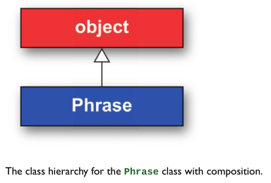

# 7. Objects and Classes

- [7. Objects and Classes](#7-objects-and-classes)
  - [7.3 Inheritance](#73-inheritance)
    - [Investigating *class hierarchy* - `__class__`, `__mro__`](#investigating-class-hierarchy---__class__-__mro__)
    - [*Composition* vs. *Inheritance*](#composition-vs-inheritance)
  - [7.4 Derived Class](#74-derived-class)
    - [Overriding methods](#overriding-methods)
    - [Python does't have private methods - Single underscore convention](#python-doest-have-private-methods---single-underscore-convention)
    - [Mangling - Double underscore convention](#mangling---double-underscore-convention)

## 7.3 Inheritance

- continued see [hartl](../README.md#hartl) p.179

### Investigating *class hierarchy* - `__class__`, `__mro__`

- When learning about Python classes, it’s useful to investigate the *class hierarchy* using  
  - the **`__class__`** and  
  - the **`__mro__`**  
  
  *attributes*.

  The latter stands for *method resolution order*.

  Let's look at an example of what this means in the case of a familiar type of *object*, a *string*:

  ``` Python
  >>> s = "foobar"
  >>> type(s)
  <class 'str'>
  >>> s.__class__
  <class 'str'>
  >>> s.__class__.__mro__
  (<class 'str'>, <class 'object'>)
  >>> 
  ```

- What this tells us is that a *string* is of **class** `str`,  
  … which in turn is of type *object*.  
  
  The latter is known as a **superclass**  
  … because it is usually thought of as being “above” the `str` class.

- `object` is the *superclass* of every Python *object*.

- The `__class_` attribute is inherited from `object`.

  ``` Python
  >>> obj = object()
  >>> type(obj)
  <class 'object'>
  AttributeError: 'object' object has no attribute '__mro__'
  >>> obj.__class__
  <class 'object'>
  >>> object().__class__
  <class 'object'>
  >>> type(obj.__class__)
  <class 'type'>  
  ```

### *Composition* vs. *Inheritance*

- Let’s return now to the `Phrase` *class*
  
- As presently defined, `Phrase` **has a** `content` *attribute*,  
  … which in the terminology of *object-oriented programming* is known as a **has-a relationship**.  
  … Such a design is known as **composition**,  
  … where a `Phrase` is **composed** of a `content` *attribute* (possibly among other things).  

  

- Another way of looking at the situation is to say that a `Phrase` **is a** `string`,  
  … which is known as an **is-a relationship**.  
  … In this case, we could arrange for the `Phrase` class to **inherit** from Python’s native `string` class.

  

- Exercise 7.3.1

  ``` Python
  >>> [].__class__
  <class 'list'>
  >>> [].__class__.__mro__
  (<class 'list'>, <class 'object'>)
  >>> {}.__class__
  <class 'dict'>
  >>> {}.__class__.__mro__
  (<class 'dict'>, <class 'object'>)
  ```

## 7.4 Derived Class

- continued see [hartl](../README.md#hartl) p.179

- Now we want to derive a new class `TranslatedPhrase` from the `Phrase` class.  
  … The purpose of this so-called **derived** class (or **subclass**) is  
  … to **reuse** as much of `Phrase` as possible  
  …  while giving us the **flexibility** to, say, test if a `translation` is a palindrome.

- We *derive* from `Phrase` by passing the *super class*' name as argument.

- Inside the `__init__` method of our *derived* class, we call Python's *special function* **`super()`**,  
  … passing the argument of the `content` parameter.

- Because `TranslatedPhrase` *inherits* from `Phrase`, an *instance* of `TranslatedPhrase` **automatically has all the methods and attributes** of a `Phrase` instance.

- see `chp007_objects_classes\package\palindrome.py`  
  commit `c0d553ad155d7ed5f4722e5ed39a8ce4ba218b97`
  
  ``` Python
  class Phrase:
    """A class to represent phrases."""

    def __init__(self, content):
      self.content = content

    def ispalindrome(self):
      """Return True for a palindrome, False otherwise."""
      return self.processed_content() == reverse(self.processed_content())

    def processed_content(self):
      """Process content for palindrome testing."""
      return self.content.lower()

    def __iter__(self):
      self.phrase_iterator = iter(self.content)
      return self
    
    def __next__(self):
      return next(self.phrase_iterator)

  class TranslatedPhrase(Phrase):
    """A class to represent phrases with translation."""

    def __init__(self, content, translation):
      # setting `content`
      super().__init__(content)
      self.translation = translation

  def reverse(string):
    """Reverse a string."""
    return "".join(reversed(string))
  ```

  ``` Python
  # PS …\learn-python-01\chp007_objects_classes\package> python
  # REPL
  >>> import importlib
  >>> import palindrome as palindrome
    >>> tphrase = palindrome.TranslatedPhrase("Madam", "Frau")
  >>> tphrase.content
  'Madam'
  >>> tphrase.translation
  'Frau'
  >>> tphrase.ispalindrome()
  True
  ```

### Overriding methods

- Now we wanted to use the translation *instead* of the `content` for deter-
mining whether the `translation` is a palindrome or not? Because we factored `processed_content()` into a *separate method*, we can do this by
**overriding** the `processed_content()` method in `TranslatedPhrase`.

- see `chp007_objects_classes\package\palindrome.py`  
  commit `774fb20cb19b01653ba9bc1bf3744e1d66772eb6`

  ``` Python
  class Phrase:
    """A class to represent phrases."""

    def __init__(self, content):
      self.content = content

    def ispalindrome(self):
      """Return True for a palindrome, False otherwise."""
      return self.processed_content() == reverse(self.processed_content())

    def processed_content(self):
      """Process content for palindrome testing."""
      return self.content.lower()

    def __iter__(self):
      self.phrase_iterator = iter(self.content)
      return self
    
    def __next__(self):
      return next(self.phrase_iterator)

  class TranslatedPhrase(Phrase):
    """A class to represent phrases with translation."""

    def __init__(self, content, translation):
      # setting `content`
      super().__init__(content)
      self.translation = translation

    def processed_content(self):
      """Override superclass method to use translation."""
      return self.translation.lower()

  def reverse(string):
    """Reverse a string."""
    return "".join(reversed(string))
  ```

  ``` Python
  # PS …\learn-python-01\chp007_objects_classes\package> python
  # REPL
  >>> import importlib
  >>> import palindrome as palindrome
  >>> tphrase = palindrome.TranslatedPhrase("Madam", "Frau")
  >>> tphrase.content
  'Madam'
  >>> tphrase.translation
  'Frau'
  >>> tphrase.ispalindrome()
  False
  >>> tphrase = palindrome.TranslatedPhrase("recognize", "reconocer")  
  >>> tphrase.ispalindrome()
  True
  >>> tphrase.__class__.__mro__
  (<class 'palindrome.TranslatedPhrase'>, <class 'palindrome.Phrase'>, <class 'object'>)
  ```

### Python does't have private methods - Single underscore convention

- Python doesn't have means to make the visibility of class' attributes and methods *private*,  
  … but *it does have a convention* for indicating them using a **leading underscore**.

- see `chp007_objects_classes\package\palindrome.py`  
  commit `103af9253abfa1ca2ff59d31d2052d6a226fa04d`

### Mangling - Double underscore convention

- Note:  
  Python has a *second convention*, known as name **mangling**,  
  … that uses **two lead-ing underscores**. 
  
  With this convention, Python **automatically changes the name of the method** in a standard way so that it **can’t** be easily accessed through an object instance.
