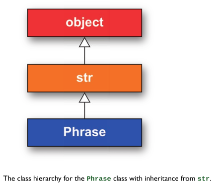

# 7. Objects and Classes

- Todo

## 7.2 Custom Iterators

- continued see [hartl](../README.md#hartl) p.179

### Investigating *class hierarchy* - `__class__`, `__mro__`

- When learning about Python classes, it’s useful to investigate the *class hierarchy* using  
  - the **`__class__`** and  
  - the **`__mro__`**  
  
  *attributes*.

  The latter stands for *method resolution order*.

  Let's look at an example of what this means in the case of a familiar type of *object*, a *string*:

  ``` Python
  >>> s = "foobar"
  >>> type(s)
  <class 'str'>
  >>> s.__class__
  <class 'str'>
  >>> s.__class__.__mro__
  (<class 'str'>, <class 'object'>)
  >>> 
  ```

- What this tells us is that a *string* is of **class** `str`,  
  … which in turn is of type *object*.  
  
  The latter is known as a **superclass**  
  … because it is usually thought of as being “above” the `str` class.

- `object` is the *superclass* of every Python *object*.

- The `__class_` attribute is inherited from `object`.

  ``` Python
  >>> obj = object()
  >>> type(obj)
  <class 'object'>
  AttributeError: 'object' object has no attribute '__mro__'
  >>> obj.__class__
  <class 'object'>
  >>> object().__class__
  <class 'object'>
  >>> type(obj.__class__)
  <class 'type'>  
  ```

### *Composition* vs. *Inheritance*

- Let’s return now to the `Phrase` *class*
  
- As presently defined, `Phrase` **has a** `content` *attribute*,  
  … which in the terminology of *object-oriented programming* is known as a **has-a relationship**.  
  … Such a design is known as **composition**,  
  … where a `Phrase` is **composed** of a `content` *attribute* (possibly among other things).  

  

- Another way of looking at the situation is to say that a `Phrase` **is a** `string`,  
  … which is known as an **is-a relationship**.  
  … In this case, we could arrange for the `Phrase` class to **inherit** from Python’s native `string` class.

  

- Exercise 7.3.1

  ``` Python
  >>> [].__class__
  <class 'list'>
  >>> [].__class__.__mro__
  (<class 'list'>, <class 'object'>)
  >>> {}.__class__
  <class 'dict'>
  >>> {}.__class__.__mro__
  (<class 'dict'>, <class 'object'>)
  ```
